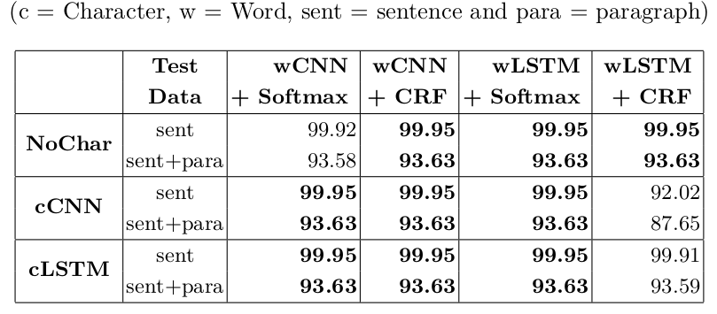
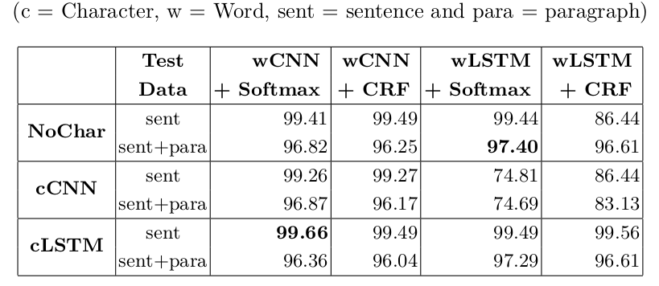

# NCRF++ Tutorial for CITA Experiments
12th Conference On Information Technology and its Applications

- [NCRF++ Installation](#NCRF++-Installation)
- [Configuration Example](#Configuration-Example)
- [Training and Testing](#Training-and-Testing)
- [Results](#Results)

For more details ...
- mySentence training with sentence-level data: https://github.com/ye-kyaw-thu/error-overflow/blob/master/ncrfpp-mysent-tagging.md
- mySentence training with sentence+paragraph-level data: https://github.com/ye-kyaw-thu/error-overflow/blob/master/ncrfpp-mysent-tagging-para.md
- mySentence cross-testing experiments: https://github.com/ye-kyaw-thu/error-overflow/blob/master/cross-testing-of-mysent-NCRFpp-models.md

## NCRF++ Installation
Step 1: Prepare conda environment

```
$ conda create -n ncrfpp python=3.6
$ conda activate ncrfpp
$ conda install pytorch==1.0.0 torchvision==0.2.1 cuda100 -c pytorch
```
Step 2: Download NCRF++ from github
```
$ git clone https://github.com/jiesutd/NCRFpp
```

GPU status used for the experiments
```
Every 2.0s: nvidia-smi                                                               gpu.cadt.edu.kh: Fri Dec 16 21:13:38 2022
Fri Dec 16 21:13:38 2022
+-----------------------------------------------------------------------------+
| NVIDIA-SMI 470.161.03   Driver Version: 470.161.03   CUDA Version: 11.4     |
|-------------------------------+----------------------+----------------------+
| GPU  Name        Persistence-M| Bus-Id        Disp.A | Volatile Uncorr. ECC |
| Fan  Temp  Perf  Pwr:Usage/Cap|         Memory-Usage | GPU-Util  Compute M. |
|                               |                      |               MIG M. |
|===============================+======================+======================|
|   0  NVIDIA GeForce ...  Off  | 00000000:0A:00.0 Off |                  N/A |
| 46%   51C    P2    62W / 300W |    908MiB / 11019MiB |     18%      Default |
|                               |                      |                  N/A |
+-------------------------------+----------------------+----------------------+
|   1  NVIDIA GeForce ...  Off  | 00000000:42:00.0 Off |                  N/A |
|  0%   54C    P8    21W / 257W |      3MiB / 11019MiB |      0%      Default |
|                               |                      |                  N/A |
+-------------------------------+----------------------+----------------------+
|   2  NVIDIA GeForce ...  Off  | 00000000:43:00.0 Off |                  N/A |
| 33%   44C    P8    29W / 250W |      3MiB / 11016MiB |      0%      Default |
|                               |                      |                  N/A |
+-------------------------------+----------------------+----------------------+

+-----------------------------------------------------------------------------+
| Processes:                                                                  |
|  GPU   GI   CI        PID   Type   Process name                  GPU Memory |
|        ID   ID                                                   Usage      |
|=============================================================================|
|    0   N/A  N/A   2702014      C   python                            905MiB |
+-----------------------------------------------------------------------------+
```

## Configuration Example
- FOr NCRF++ tool, CRF format data should be used.
- Dataset format example ...
```
$ head -5 ./data/data-sent/sent_data_crf_format/train.col 
ဘာ B
ရယ် O
လို့ O
တိတိကျကျ O
ထောက်မပြ O
```
- Training Configuration
  - I/O: Input/Output data files
  - Network Configuration
  - Training Setting
  - Hyperparameters

```
### use # to comment out the configure item

### I/O ###
train_dir=/home/yekyaw.thu/tool/NCRFpp/mysent-config/data/sent/train.col
dev_dir=/home/yekyaw.thu/tool/NCRFpp/mysent-config/data/sent/valid.col
test_dir=/home/yekyaw.thu/tool/NCRFpp/mysent-config/data/sent/test.col
model_dir=/home/yekyaw.thu/tool/NCRFpp/mysent-model/wordlstm-charcnn
#word_emb_dir=sample_data/sample.word.emb

#raw_dir=
#decode_dir=
#dset_dir=
#load_model_dir=
#char_emb_dir=

norm_word_emb=False
norm_char_emb=False
number_normalized=True
seg=True
word_emb_dim=50
char_emb_dim=30

###NetworkConfiguration###
use_crf=False
use_char=True
word_seq_feature=LSTM
char_seq_feature=CNN
#feature=[POS] emb_size=20
#feature=[Cap] emb_size=20
#nbest=1

###TrainingSetting###
status=train
# optimizer can be SGD/Adagrad/AdaDelta/RMSprop/Adam
optimizer=SGD
iteration=100
batch_size=10
ave_batch_loss=False

###Hyperparameters###
cnn_layer=4
char_hidden_dim=50
hidden_dim=200
dropout=0.5
lstm_layer=1
bilstm=True
learning_rate=0.015
lr_decay=0.05
momentum=0
l2=1e-8
gpu=True
#clip=
```
- Decoding Configuration
```
### Decode ###
status=decode
#raw_dir=sample_data/raw.bmes
raw_dir=/home/yekyaw.thu/tool/NCRFpp/mysent-config/data/sent/test.col
#nbest=1
#nbest=10
decode_dir=/home/yekyaw.thu/tool/NCRFpp/mysent-hyp/wordlstm-charcnn.hyp
#dset_dir=sample_data/lstmcrf.dset
dset_dir=/home/yekyaw.thu/tool/NCRFpp/mysent-model/wordlstm-charcnn.dset
#load_model_dir=sample_data/lstmcrf.0.model
load_model_dir=/home/yekyaw.thu/tool/NCRFpp/mysent-model/wordlstm-charcnn.0.model
```

## Training and Testing
### Training 
```
$ python main.py --config ./mysent-config/word-lstm.char-cnn.train.config
```

### Testing
```
python main.py --config ./mysent-config/word-lstm.char-cnn.decode.config | tee ./mysent-model/wordlstm-charcnn.decode.log
```

## Results
The following tabels show the experimental results of our experiments presented to CITA 2023.

Table: Accuracy % comparison of sentence-level models


Table: Accuracy % comparison of sentence+paragraph-level models

